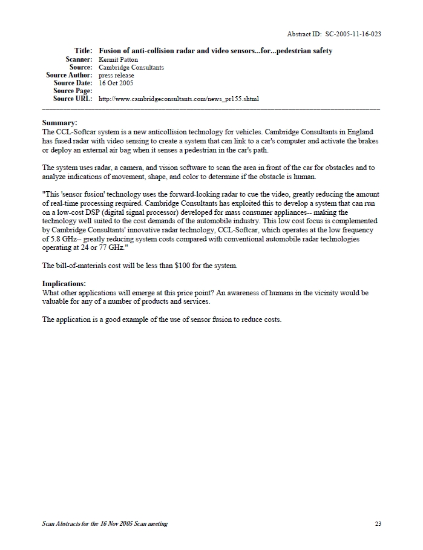
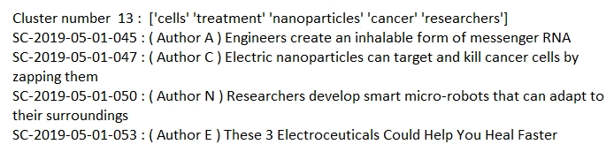

# Technological and Societal Trend Analysis and Forecasting
["Scan™ offers companies an early jump on the future."](http://www.strategicbusinessinsights.com/scan/about.shtml) It is a program offered by [Strategic Business Insights](http://www.strategicbusinessinsights.com/) at [SRI International](https://www.sri.com/). Contributors from variuos fields nominate articles (news, science etc.) that are compiled every month into a document containing 100 articles. An expert panel representing diverse sectors and backgrounds meets once a month to discuss these articles and identify major trends that span across sectors and thus could have a major impact. The panel clusters the articles into groups, each of which potentially represents a major trend across sectors. 
The scripts provided in the repository ingest the pdf document containing the 100 abstracts and cluster them based on semantic similarity using natural language processing (NLP). Specifically, the [word2vec](https://arxiv.org/abs/1301.3781) and [doc2vec](https://arxiv.org/abs/1405.4053) implementation [gensim](https://radimrehurek.com/gensim/) is used. This automated clustering is a good starting point when facing the task of reading large amounts of articles. Humans can keep only a limited amount of information in memory and establish connections only among this limited amount of data, while the provided NLP algorithm can run on much larger data sets. On the other hand, humans can see connections that are not explicitly mentioned in the articles and can bring in additional outside knowledge to assess the articles. 
## Usage
First, use `convert all pdfs to dfs.ipynb` to ingest the pdf files containing the articles (fig. 1). The output is a pandas dataframe with one row for each article. Columns are *title*, *author*, *source*, *article body*, *date* (or similar) and so on. 
Then, use `Cluster abstracts with doc2vec.ipynb` to cluster the articles. The output is a list of clusters (fig. 2). Each cluster has a primitive name made up of the most frequent words in the cluster. Below the cluster name, the *titles* of the articles are listed. Using the rand index, the clustering done by doc2vec can be compared to the ground truth human clustering (if provided). 
 
Fig. 1: Screenshot of an example article. Each pdf contain about 100 such articles.
 
Fig. 2: Excerpt from an example list of clusters. The number of clusters or the minimum number of articles per cluster can be adjusted.
